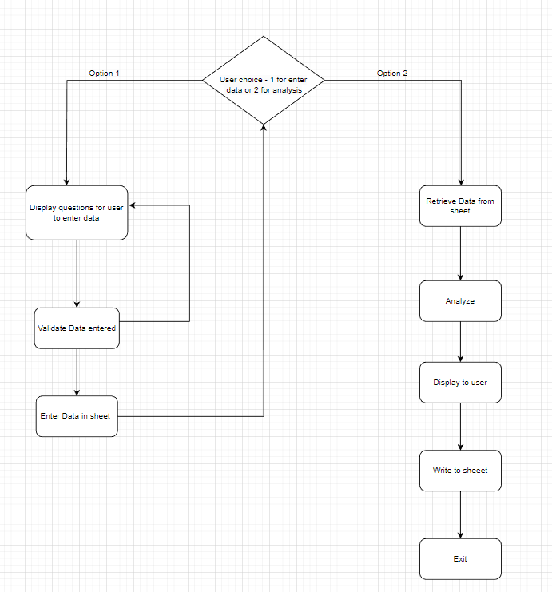

Welcome,

This is the Code Institute student template for deploying your third portfolio project, the Python command-line project. The last update to this file was: **March 14, 2023**

## Reminders

- Your code must be placed in the `run.py` file
- Your dependencies must be placed in the `requirements.txt` file
- Do not edit any of the other files or your code may not deploy properly

## Creating the Heroku app

When you create the app, you will need to add two buildpacks from the _Settings_ tab. The ordering is as follows:

1. `heroku/python`
2. `heroku/nodejs`

You must then create a _Config Var_ called `PORT`. Set this to `8000`

If you have credentials, such as in the Love Sandwiches project, you must create another _Config Var_ called `CREDS` and paste the JSON into the value field.

Connect your GitHub repository and deploy as normal.

## Constraints

The deployment terminal is set to 80 columns by 24 rows. That means that each line of text needs to be 80 characters or less otherwise it will be wrapped onto a second line.

---

Happy coding!

# Fuel Card Analysis Program

This is an online data entry program for a user in the Fuel Card Team to enter in survey results returned by customers or to view the analysis of the surveys already entered. The analysis will also be entered into the Analysis worksheet.

## User Story
+ As a member of a Fuel Card team, we have issued out surveys to all current customers to analyze our customer base and see how they rate our service. We want to be able to enter
data returned and also view the analysis and have it entered into a spreadsheet so it can be monitored and differences viewed as more results are entered.

## Implementation flow chart

## Features

## Libraries Used

## Testing

## Features left to implement

## Bugs

## Validator Testing

## Deployment

## Credits
