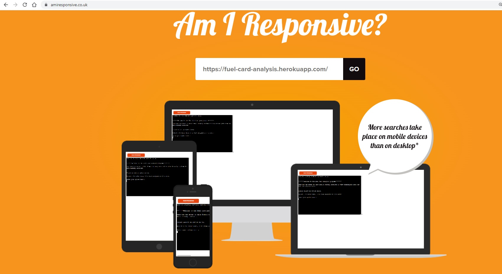
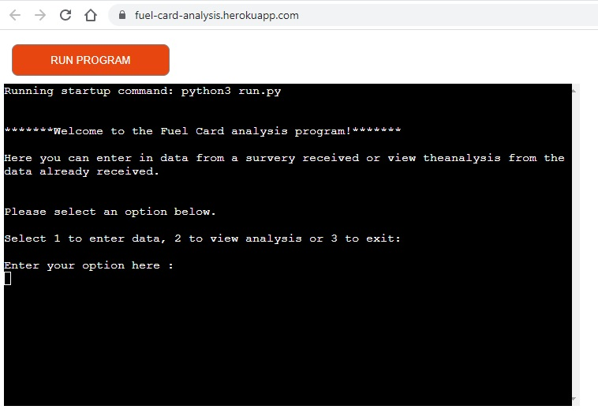
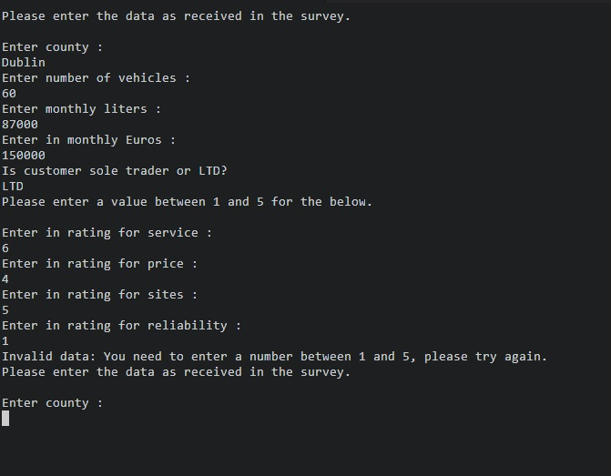
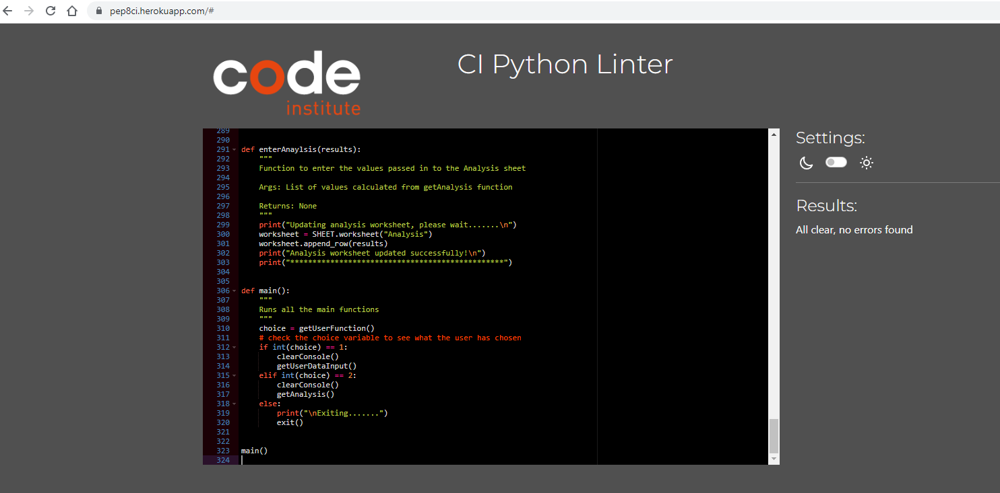

# Fuel Card Analysis Program

This is an online data entry program for a user in the Fuel Card Team to enter in survey results returned by customers or to view the analysis of the surveys already entered. The analysis will also be entered into the Analysis worksheet.

## User Story

+ As a member of a Fuel Card team, we have issued out surveys to all current customers to analyze our customer base and see how they rate our service. We want to be able to enter
data returned and also view the analysis and have it entered into a spreadsheet so it can be monitored and differences viewed as more results are entered.

## Implementation flow chart

## Features

+ Allows the user to select whether to enter in data or view analysis

+ Data is validated and if invalid, it will inform the user and ask for the data to be entered again.

+ Display the analysis of all entered data to the user via the terminal

+ Enters the analysis into the Analysis spreadsheet on Google Sheets

## Future Features

+ Analyse the data in more detail, for example: where a customer has entered a low rating for sites, get the counties for those and identify where more local sites could be obtained.
+ Enter in customer's account number so the program could check for low service ratings and the customer could be contacted to see where this could be improved.
+ Have the user to login to run the program and record the users login on the sheet in a seperate column.

## Development

For another developer to add to this program, they would need to obtain access to the Google sheet and utilise the libraries below in order to build in the futre features listed above.

## Libraries Used

+ Gspread
+ DateTime
+ OS
+ Pandas

## Testing

To test the program for entering data, please enter the below;

| Question                  | Answer |
| --------                  | ------ |
| County:                   | Sligo  |
| Number of vehicles:       | 9      |
| Monthly spend (lts):      | 10000  |
| Monthly spend (€):        | 18500  |
| Limited or sole trader:   | LTD    |
| Service Rating:           | 5      |
| Price Rating:             | 1      |
| Sites Rating:             | 4      |
| Reliabilty Rating:        | 5      |

This data will then be entered in a new row on the Data worksheet.

To view the analysis, select 2 and the data will be displayed to the screen and entered into the Analysis spreadsheet.

## Bugs

+ There was an issue when trying to seperate out the array which contained the entered data. As there was a combination of both strings and integers, these had to be seperated out so the data could be validated. 
+ When getting the current customer count, it was not working correctly. I then imported the Pandas library and used the "value_counts" which returned the correct value.
+ There was an issue where they were warnings detected from lines being too long.
I reseached this and was able to resolve. 

## Validator Testing

I ran the Python code through the linter at https://pep8ci.herokuapp.com/# and there were no errors found.

## Deployment

This program was deployed using Heroku.

The steps to deploy using Heroku are:
+ In the settings tab, add in the the creds and port config vars
+ Add in the relevant build packs. In this case, it was Python and Node JS
+ Connect to GitHub
+ Locate repository using the repo name
+ Deploy manaully using main branch

### Links

+ Live link : https://fuel-card-analysis.herokuapp.com/ 
+ Repository : https://github.com/Joannamcgallagher/fuel-card-analysis
+ Google Sheet: https://docs.google.com/spreadsheets/d/1WFYC9nJ58GSUauFM8Ws0mgEDMuzy5lKIJDhMDM0ioio/edit#gid=0

## Credits

+ Love Sandwiches walkthrough.
+ https://www.w3schools.com/python/pandas/pandas_getting_started.asp for importing and using the Pandas library.
+ https://www.geeksforgeeks.org/get-current-date-using-python/ for importing the date time library.
+ https://www.delftstack.com/howto/python/python-clear-console/?utm_content=cmp-true for importing and using the OS library
+ https://www.codecademy.com/resources/docs/markdown/tables for using tables in Markdown

